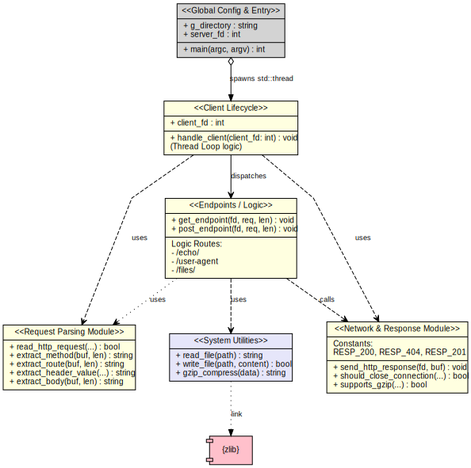
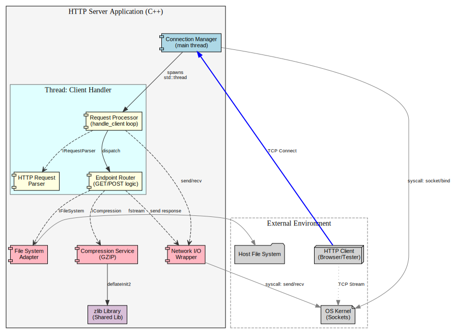

# C++ Multi-Threaded HTTP Server

A lightweight, multi-threaded HTTP/1.1 server implemented from scratch in C++. This project demonstrates low-level socket programming, manual HTTP request parsing, and concurrency using the POSIX API, without relying on external web frameworks.

## 🚀 Features

*   **No Web Frameworks**: Built using standard system libraries (`<sys/socket.h>`, `<unistd.h>`, etc.).
*   **Concurrency**: Uses `std::thread` to handle multiple client connections simultaneously.
*   **HTTP 1.1 Support**:
    *   Handles persistent connections (Keep-Alive) unless `Connection: close` is specified.
    *   Parses HTTP Headers and Body manually.
*   **Compression**: Supports GZIP compression for the `/echo` endpoint using `zlib`.
*   **File I/O**: Capability to upload and read files from the server's local file system.

---

## 🛠️ Prerequisites

To build and run this server, you need a UNIX-based operating system (Linux or macOS) due to the use of POSIX headers (`<arpa/inet.h>`, `<sys/types.h>`, etc.).

### System Requirements
*   **C++ Compiler**: GCC (`g++`) or Clang.
*   **Make** (Optional, if you use a Makefile).
*   **zlib**: Required for compression features.

### Installing Dependencies

**Ubuntu/Debian:**
```bash
sudo apt-get update
sudo apt-get install build-essential zlib1g-dev
```

**macOS:**
```bash
xcode-select --install
# zlib is usually included in macOS SDK, but you can also use brew:
brew install zlib
```

---

## ⚙️ Build Instructions

The server is contained in a single file (assuming `server.cpp`). You must link against `pthread` (for threading) and `zlib` (for compression).

```bash
# Compile using g++
g++ -o server server.cpp -lz -pthread -std=c++11

# Or using clang++
clang++ -o server server.cpp -lz -pthread -std=c++11
```

---

## 🏃 Usage

Start the server. By default, it runs on port **4221**.

### 1. Basic Start
```bash
./server
```

### 2. Serving a Specific Directory
To enable the File I/O endpoints (`/files/`), you must specify the directory where files will be read from/written to.

```bash
mkdir /tmp/server_files
./server --directory /tmp/server_files
```

---

## 📡 API Endpoints

### 1. Root Check
Returns a 200 OK status.
*   **Method**: `GET`
*   **Path**: `/`

```bash
curl -v http://localhost:4221/
```

### 2. Echo Service
Reflects the path back as the response body.
*   **Method**: `GET`
*   **Path**: `/echo/{string}`
*   **Optional Header**: `Accept-Encoding: gzip` (Returns binary compressed data)

**Example (Plain Text):**
```bash
curl -v http://localhost:4221/echo/HelloCodeCrafters
```

**Example (GZIP Compressed):**
```bash
curl -v -H "Accept-Encoding: gzip" http://localhost:4221/echo/CompressMe --output response.gz
```

### 3. User-Agent
Returns the `User-Agent` header value sent by the client.
*   **Method**: `GET`
*   **Path**: `/user-agent`

```bash
curl -v http://localhost:4221/user-agent -A "MyCustomAgent/1.0"
```

### 4. File Retrieval
Reads a file from the directory specified via the `--directory` flag.
*   **Method**: `GET`
*   **Path**: `/files/{filename}`

```bash
# Requires ./server --directory /tmp
echo "Secret Content" > /tmp/test.txt
curl -v http://localhost:4221/files/test.txt
```

### 5. File Upload
Creates (or overwrites) a file in the directory specified via the `--directory` flag.
*   **Method**: `POST`
*   **Path**: `/files/{filename}`
*   **Body**: The file content.

```bash
curl -v -X POST -d "New file content" http://localhost:4221/files/newdata.txt
```

---

## 🧩 Architecture

This project is structured logically around the separation of concerns, despite being implemented procedurally in C++.





### Key Components

1.  **Main Loop (`main`)**:
    *   Initializes the Server Socket (binds to port 4221).
    *   Runs an infinite loop accepting connections.
    *   Spawns a **Detached Thread** for every new client connection.

2.  **Client Handler (`handle_client`)**:
    *   Parses the incoming byte stream into an HTTP Request (String).
    *   Loops to handle "Keep-Alive" connections automatically.
    *   Determines whether to call `get_endpoint` or `post_endpoint`.

3.  **Parsers**:
    *   `read_http_request`: Custom raw memory logic (`recv`, `realloc`) to build the request string.
    *   `extract_header_value`: Manually searches HTTP strings for headers.

4.  **Utilities**:
    *   `gzip_compress`: Interfaces with the `zlib` C library to compress request bodies.

---

## ⚠️ Limitations & Security Note

This project is for **educational purposes**. It implements a subset of HTTP/1.1 and contains security limitations common in scratch-built servers:
*   **Security**: There are no checks for "directory traversal" (e.g., `../../etc/passwd`).
*   **Parsing**: The HTTP parser assumes well-formed headers and has rudimentary error handling.
*   **Memory**: Manual memory management (`malloc`/`free`) is used in the request reader; strictly standard C++ (`vector`) would be safer for production.

---

## 📜 License

This project is open source. Feel free to use it for learning networking concepts in C++.
